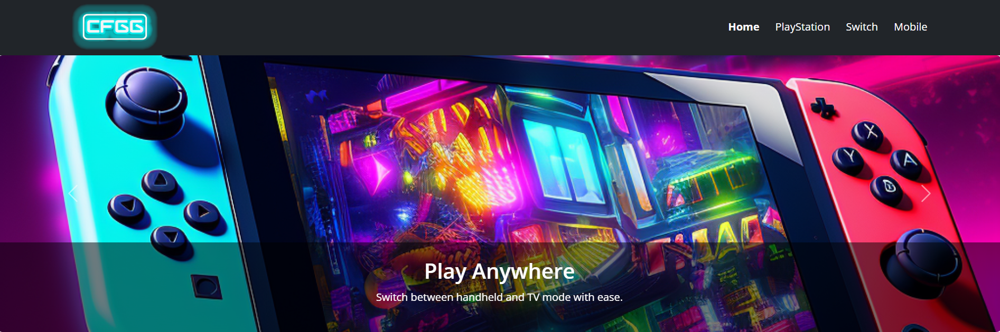
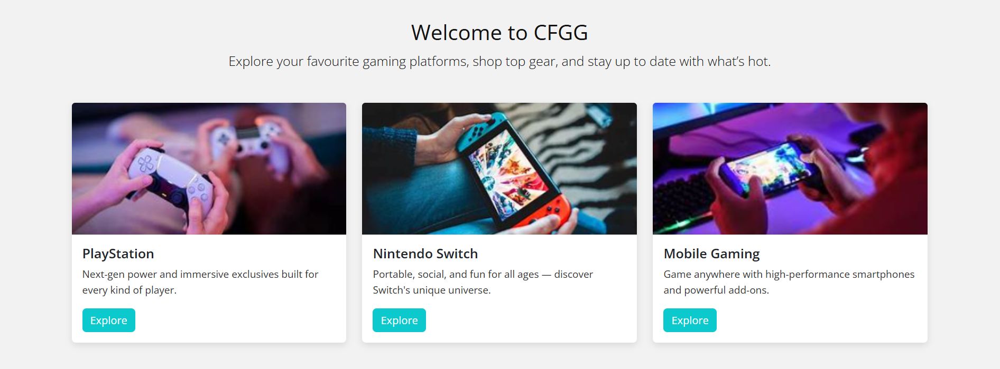
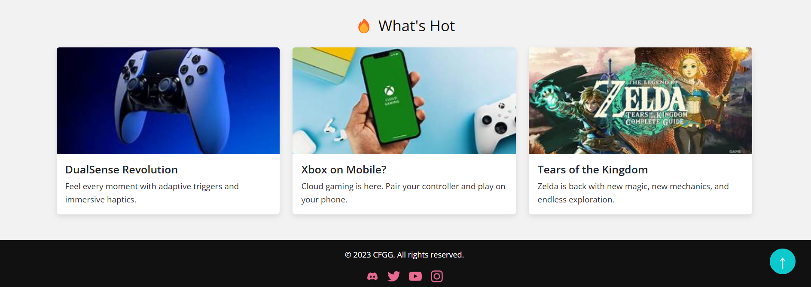
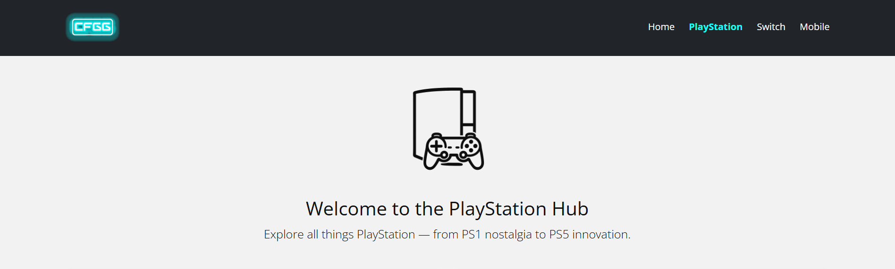
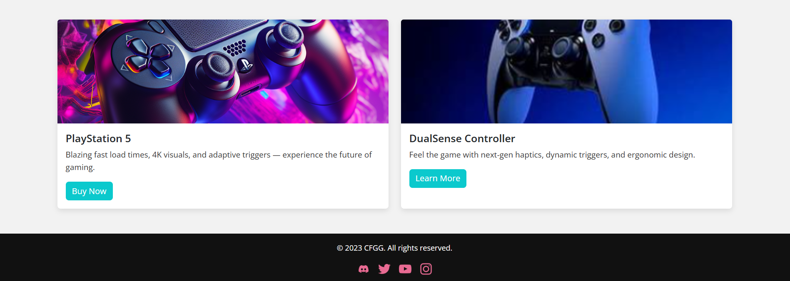

# 🎮 CFGG Website – Code First Girls Final Project

Welcome to the CFGG (Code First Girls Gaming) e-commerce website — a stylish, responsive multi-page site showcasing popular gaming platforms: PlayStation, Nintendo Switch, and Mobile Gaming.

---

## 📸 Preview Home Page





---
## 📸 Preview Secondary Page




---

## 🧠 What I Learned

This project helped me solidify key web development concepts:

- ✅ HTML5 semantic structure
- ✅ Responsive design with CSS and Bootstrap
- ✅ Image optimization and accessible markup
- ✅ JavaScript for interactivity (scroll to top)
- ✅ Folder structuring and reusable components
- ✅ GitHub version control and documentation

---

## 📁 Project Structure

```
CFGG-website/
├── index.html
├── playstation.html
├── switch.html
├── mobile.html
│
├── css/
│   └── main.css
│
├── js/
│   └── main.js
│
├── assets/
│   ├── images/
│   ├── icons/
│   └── logos/
│
├── docs/
│   └── project-story.md
│
└── README.md
```

---

## 🔧 How to Run the Project

1. Clone the repo:
   ```bash
   git clone https://github.com/your-username/CFGG-website.git
   ```

2. Open `index.html` in any modern browser.

No installation needed — it's a static site!

---

## 🧪 Features

-  Full-width responsive hero carousel
-  Clean navigation with mobile toggle menu
-  Iconic product pages with platform branding
-  Scroll-to-top functionality with JavaScript
-  Mobile-first design across all pages
-  Modern card layout and animations

---

## 🙋‍♀️ About Me

This website was built as my final project for the **Code First Girls Introduction to Web Development** course.  
I developed the project using **PyCharm** with a focus on UX, code clarity, and accessibility.

---

## 📌 Future Improvements

- Add user login / checkout mockup
- Add product filtering or sorting
- Dark mode toggle
- Animated transitions between sections

---

## 👤 Author

Made with 🧠 and curiosity by Alex

_CFGG is a fictional brand created for educational purposes._
